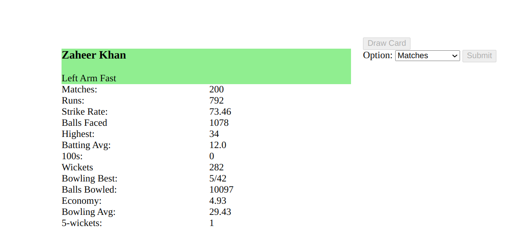
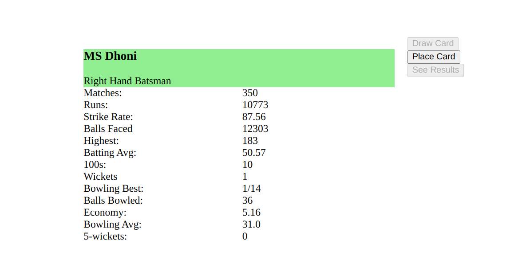

### Cricket Cards

### Introduction:

Hello User,  
 I created this web game inspired by card games I played back when I was a kid. Back in the time, we used to play card games based on cricketers, WWE wrestlers and even cartoon characters. I was feeling nostalgic while creating this, and I hope you feel happy playing this game.

### Instructions:

1.  The game begins with equal number of cards shuffled and split between two players.
2.  As soon as the game starts, both players can see cards on top of their card stack.
3.  The first player to join the room will be the priority player and he/she will have the privilege to choose the criteria by which the players should be compared.
    
4.  The second player to join the room can place the card at the top of his stack and wait for the first player to submit his card.
   
5.  Note that, only after second player places his card submit button in the first player's page gets enabled, and he can submit the button. Similarly, only after the first player submits the card, 'See Result' button in second player page becomes enabled
6.  After the card is submitted, priority player will get the result, other player should click on button to see result.
7.  If the stats on the option selected by the priority player is better on your card, you will win a card. In case the stats are equal the priority player will lose the card
8.  If you have won a card and you are the first player, your priority status will be retained, but if you lose the card, you will lose the priority status and your opponent will have the priority status. Until you win a card, the opponent will have the priority status.
9.  The new card won by the player and the top card used to win the card will be added to the bottom of the card stack. When new card is drawn, the latest card on top of stack will emerge.
